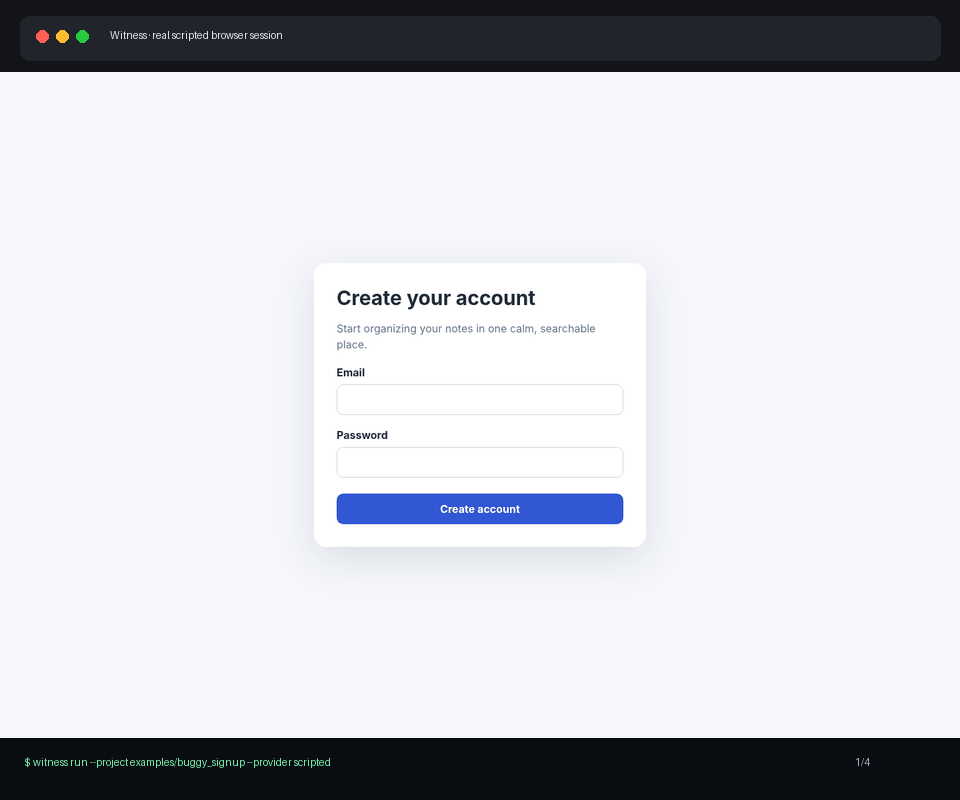

# Witness

> **Agentic QA that uses software like a person, observes what actually happened, and reports evidence—not guesses.**

Witness is an open-source QA harness for **web apps, Flutter mobile apps, Electron desktop apps, CLIs, HTTP APIs, browser games, Unity/Unreal builds, screenshots, and visual frame sequences**. It performs real actions, preserves screenshots/terminal output/HTTP exchanges, compares observations across turns, and requires every model decision to follow the same load-bearing loop:

**expectation → observation → judgment → next action**

Witness is designed for Codex and Claude Code as well as direct model APIs. With Codex, **no OpenAI API key is required**: the recommended native mode lets the current interactive Codex session reason directly, while the unattended mode runs `codex exec` with the user's cached **Sign in with ChatGPT** authentication.



[Read the exact terminal transcript](docs/assets/demo-transcript.txt).

## Why Witness

Traditional smoke tests confirm that selectors and status codes exist. Witness asks harder questions:

- Can a first-time user understand and complete the primary journey?
- Did the UI visibly change after an action, or did nothing happen?
- Did the CLI return useful output and the correct exit status?
- Does the API behave consistently with its documented contract?
- Is a game HUD clipped, unreadable, stretched, stale, jittering, or inconsistent across frames?
- Is the observed problem a product defect, or did the testing infrastructure fail?

Every finding includes a stable fingerprint, persona, expectation, observed fact, judgment, black-box hypothesis, suggested investigation, severity, and linked evidence.

## What ships in 1.2

- README-first weighted detection for web, Flutter mobile, Electron desktop, CLI, API, Unity, Unreal, Godot, and game/visual targets
- Real Playwright browser actions, screenshots, DOM geometry, console errors, request failures, downloads, dialogs, and observation deltas
- Real PTY-backed CLI sessions with safe command policy, isolated copy workspaces, terminal screenshots, exit codes, and changed-file tracking
- OpenAPI discovery and stateful HTTP action sequences with sensitive-value redaction
- Game/visual adapter for frame sequences, reference images, command templates, and file-based Unity/Unreal engine bridges
- Visual metrics for blankness, edges, dominant colors, perceptual hashes, frame/reference differences, clipping, alignment, and contrast warnings
- Built-in first-time, adversarial, keyboard-only, slow-mobile, low-vision, visual bug-hunter, simulator visual-director, and game visual-director personas
- Test-plan generation and multi-persona × multi-journey campaigns
- OpenAI, Anthropic, command, scripted, **native Codex host**, and **Codex CLI OAuth** reasoning modes
- Replayable traces, baseline comparison, benchmark scoring, stable finding fingerprints, enforceable USD budgets, and token-bounded delta-first prompts
- Evidence-to-fix remediation workspaces with patch/agent delegation, verification gates, and optional safe apply
- Markdown, HTML, JSON, JUnit XML, SARIF reports, and evidence-backed GitHub pull-request comments
- A Codex Agent Skill, Codex plugin/marketplace package, Claude Code skill, cross-platform installer, and CI installation smoke tests

## Install for Codex — recommended

After publishing this repository to GitHub, give Codex this instruction:

```text
Install Witness from this GitHub repository as my global Codex QA skill and runtime.
Use the repository's Codex installer, verify `codex login status`, and do not ask me
for an OpenAI API key. I use Sign in with ChatGPT. When testing interactively,
use Witness native host mode; use the codex-cli provider only for unattended runs.
```

Codex can install the repository through either supported distribution surface.

### Plugin marketplace installation

```bash
codex plugin marketplace add OWNER/REPOSITORY
codex plugin add witness-qa@witness
```

The plugin contains `skills/codex/witness/`. On first use the skill runs the reviewed bootstrap script from the installed plugin checkout, creates an isolated Witness virtual environment, installs Chromium, copies the user skill to `~/.agents/skills/witness`, and verifies the Codex login.

### Direct repository installation

```bash
git clone https://github.com/OWNER/REPOSITORY.git
cd REPOSITORY
./scripts/install-codex.sh
```

Windows PowerShell:

```powershell
git clone https://github.com/OWNER/REPOSITORY.git
Set-Location REPOSITORY
.\scripts\install-codex.ps1
```

The installer does not read, copy, or request an API key. By default it requires `codex login status` to succeed. Use `--skip-browser` only for CLI/API/image-only installations and `--no-login-check` only for controlled packaging tests.

After installation, restart Codex only if the new skill is not immediately visible, then invoke it explicitly:

```text
$witness Test this project end to end as a first-time user. Inspect every screenshot,
report evidence-backed defects, fix confirmed issues in an isolated workspace, and rerun.
```

## Manual Python installation

```bash
python -m venv .venv
source .venv/bin/activate            # Windows: .venv\Scripts\activate
python -m pip install -U pip
python -m pip install -e .
witness install-browser
witness doctor
```

Python 3.11–3.13 is supported.

## Codex without an API key

Witness provides two deliberately separate Codex modes.

### 1. Native Codex host mode — default inside Codex

The active Codex task is the multimodal reasoner. Witness owns only deterministic project control and evidence capture:

```text
Current Codex task (vision + reasoning)
        ↕ strict decision JSON
Witness loopback host session
        ↕
Web / Electron / CLI / API / Game adapter
```

The skill performs this loop:

```bash
witness session start --project . --persona first-time-user --output witness-output
# Codex inspects the returned screenshot/structured evidence and creates one decision.
witness session submit --session witness-output \
  --expected-turn 1 \
  --decision-file /tmp/witness-decision.json
# Repeat until terminal, then inspect witness-output/report.md.
```

The adapter process remains alive between turns. The daemon binds only to `127.0.0.1`, uses a random bearer token stored with user-only permissions where supported, rejects stale turn submissions, and removes the token after completion. This mode does not launch a nested model process and needs no provider credential.

### 2. Codex CLI OAuth provider — unattended/headless

For a self-running terminal command outside an active Codex reasoning loop:

```bash
codex login
codex login status
witness run --project . \
  --provider codex-cli \
  --persona first-time-user \
  --output witness-output
```

Each reasoning turn uses `codex exec` with an ephemeral session, read-only sandbox, current screenshot attachment, strict output schema, and the cached Sign in with ChatGPT credentials. Witness never opens `~/.codex/auth.json` and never writes OAuth credentials to its artifacts.

Use native host mode from an interactive `$witness` task. Select `--provider codex-cli` only when a nested/self-running Codex process is intentionally desired.

See [Codex integration](docs/CODEX_INTEGRATION.md) for installation, protocol, security, and troubleshooting details.

## Other reasoning modes

### Direct API provider

```bash
export OPENAI_API_KEY="..."          # or ANTHROPIC_API_KEY
witness run --project examples/buggy_signup \
  --persona first-time-user \
  --output witness-output/signup
```

### Generic host/local command

```bash
witness run --project examples/buggy_signup \
  --provider command \
  --agent-command './scripts/my-model-wrapper' \
  --output witness-output/signup
```

The command reads one JSON request from stdin containing `system`, `prompt`, `schema`, and `screenshot_path`, then prints one schema-valid decision object to stdout. This supports enterprise gateways and local multimodal runners.

### Reproducible scripted decisions

```bash
witness run --project examples/buggy_signup \
  --provider scripted \
  --decision-file validation/decisions/web_signup.json
```

Scripted mode executes **real adapters and real product processes**; only the already-reviewed model decisions are replayed.

## Test your own project

```bash
# Inspect weighted detection
witness detect .

# Generate a test plan without starting the product
witness plan . --output witness-plan.md

# Run one journey
witness run --project . --journey "Create an account and reach the dashboard"

# Run a campaign
witness run --project . \
  --persona first-time-user \
  --persona keyboard-only-user \
  --persona slow-mobile-user \
  --journey "Complete the primary flow" \
  --journey "Recover from invalid input"

# Fail CI on medium-or-worse findings
witness run --project . --fail-on medium
```

## Web QA

WebAdapter supports navigation, resilient accessible locators, click/double/right-click, hover, typing, key presses, select/check, upload, drag-and-drop, scrolling, dialogs, tabs, downloads, waits, viewport/persona configuration, full screenshots, DOM geometry, contrast estimates, console/page errors, request failures, HTTP failures, and same-origin navigation policy.

```bash
witness run --project http://127.0.0.1:3000 \
  --adapter web \
  --persona low-vision-user
```

## Flutter mobile QA

MobileAdapter uses Appium to drive Android and iOS applications with real taps, text entry, scroll gestures, screenshots, and native accessibility/source snapshots. Flutter projects are detected from `pubspec.yaml`, `android/`, `ios/`, and `lib/main.dart`; Witness also tries to infer Android package/activity and iOS bundle metadata so an already-installed app can be attached with minimal config.

```yaml
project:
  type: mobile
  appium_server_url: http://127.0.0.1:4723
  mobile_platform_name: android   # or ios
  mobile_device_name: emulator-5554
  mobile_app: build/app/outputs/flutter-apk/app-debug.apk
  # Alternative for an installed app:
  # mobile_app_package: com.example.app
  # mobile_app_activity: .MainActivity
  # mobile_bundle_id: com.example.app
```

```bash
witness run --project . \
  --adapter mobile \
  --persona first-time-user \
  --journey "Sign in and reach the home screen"
```

Flutter semantics/accessibility labels materially improve locator quality. For the highest-signal runs, use a real device or production-like emulator/simulator image. See [Mobile testing](docs/MOBILE.md).

## Electron desktop QA

Electron projects are detected from `package.json` and driven through a loopback-only Chromium DevTools connection. The adapter reuses the same resilient accessible locators, screenshots, DOM geometry, console/network evidence, downloads, dialogs, and visual checks as WebAdapter.

```bash
witness run --project . --adapter desktop --persona first-time-user
```

```yaml
project:
  type: desktop
  start: npm run start
  # Optional; Witness otherwise reserves a free loopback port.
  electron_debug_port: 9222
  # Default: isolate Electron state from the developer's real profile.
  electron_isolated_profile: true
```

See [Electron testing](docs/ELECTRON.md). Native OS dialogs and privileged main-process APIs require explicit project-owned test seams rather than hidden global automation.

## CLI QA

CLIAdapter uses a real pseudo-terminal on POSIX systems and records terminal-state PNGs. Destructive or privileged commands are blocked by default. In safe mode, the project is copied into a temporary workspace and all modified files are reported.

```bash
witness run --project examples/friendly_cli \
  --adapter cli \
  --journey "Inspect help, run the happy path, then verify invalid input"
```

## API QA

APIAdapter discovers OpenAPI/Swagger documents and executes stateful HTTP requests. Authentication headers and sensitive body fields are redacted from traces while still being used for the real request.

```bash
python examples/sample_api/app.py --port 8000 &
witness run --project examples/sample_api \
  --adapter api \
  --url http://127.0.0.1:8000 \
  --journey "Create a project, retrieve it, and verify invalid input"
```

## Game and visual QA

### Browser games

Use WebAdapter to interact with menus and canvas-adjacent controls while collecting page screenshots, browser errors, failed requests, responsive-layout evidence, and frame-to-frame changes.

### Native/desktop games

Use GameAdapter with an ordered screenshot directory, command templates, or the file-based Unity/Unreal bridge. Engine integrations use atomic files rather than an exposed network port: Witness writes a command, the engine captures a real frame or emits a named test action, and the engine acknowledges the exact request.

```yaml
version: 1
project:
  type: game
  start: ./build/MyGame --qa-mode
  capture_command: ./tools/capture-frame --output {output}
  input_command: ./tools/send-input --kind {kind} --key {key} --x {x} --y {y}

session:
  personas: [game-visual-director]

visual:
  reference_images:
    - references/main-menu.png
    - references/gameplay.png
  visual_regression_threshold: 0.01
```

The visual-director workflow evaluates safe areas, clipping, alignment, hierarchy, typography, contrast, iconography, stretched or blurred assets, seams, z-order, stale overlays, debug residue, state continuity, flicker, transition residue, aspect ratios, and reference-image differences.

For Unreal-based simulators such as CARLA, use `--persona simulator-visual-director` (or `carla-visual-director`) and annotate `witness-game.json` with `profile: "carla"` plus simulation tags when possible. Witness will then bias its visual audit toward actor collisions, overlay conflicts, lane/sign readability, weather visibility, debug residue, and temporal stability.

```bash
witness run --project examples/game_visual_review/frames \
  --adapter game \
  --persona game-visual-director
```

Install the packaged engine bridge directly from the Witness CLI (no extra download):

```bash
witness install-engine-bridge unity Packages/com.witness.qa
witness install-engine-bridge unreal Plugins/WitnessBridge
```

The repository templates remain available at `integrations/unity/com.witness.qa` and `integrations/unreal/WitnessBridge`. Configure the build with `witness-game.json` and the supplied JSON Schema. Relative bridge directories are constrained to the project/output tree by default. See [Engine bridges](docs/ENGINE_BRIDGES.md) and [Game Visual QA](docs/GAME_VISUAL_QA.md).

## Cost and token controls

Direct OpenAI/Anthropic pricing is deliberately configuration-driven because model prices change. Set current per-million-token rates, bound prompt history and output size, and stop gracefully at a hard budget:

```yaml
provider:
  input_cost_per_million: 2.50
  output_cost_per_million: 10.00
  history_turns: 6
  max_observation_chars: 12000
  max_output_tokens: 1800
  image_policy: changed

session:
  max_cost_usd: 0.50
```

```bash
witness run --project . --max-cost 0.50
witness plan . --max-cost 0.50
```

Witness sends compact observation deltas, a bounded history tail, content hashes, and only changed screenshots for web/CLI/Electron sessions. Game sessions retain screenshots because visual continuity is the primary evidence. When a configured direct-provider budget is exceeded, Witness stops before the next action and writes `budget_exceeded: true` while preserving the report and artifacts. Codex OAuth/native modes do not expose a reliable per-call USD price, so they record latency/request metadata without pretending to know a dollar cost.

## GitHub pull-request comments

```bash
GITHUB_TOKEN=... GITHUB_REPOSITORY=owner/repo PR_NUMBER=42 \
  witness post-github-comment witness-output/result.json
```

Use `--dry-run` to inspect the redacted Markdown. See [GitHub PR comments](docs/GITHUB_PR_COMMENTS.md) for a complete Actions example.

## Evidence-to-fix remediation

Witness discovers defects first, then performs remediation through a separate, auditable boundary. The original project is unchanged by default. `--apply` is accepted only after at least one verification command succeeds.

```bash
# Apply a reviewed patch to an isolated copy and verify it
witness remediate witness-output/result.json \
  --patch fix.patch \
  --verify 'pytest -q' \
  --output witness-remediation

# Delegate to a trusted coding agent
witness remediate witness-output/result.json \
  --agent-command './scripts/fix-with-host-agent' \
  --verify 'pytest -q'

# Copy verified changes back only with explicit intent
witness remediate witness-output/result.json \
  --patch fix.patch \
  --verify 'pytest -q' \
  --apply
```

Rerun the same persona and journey against the remediation workspace before applying. See [Remediation](docs/REMEDIATION.md).

## Configuration

Generate a commented configuration:

```bash
witness init
```

```yaml
version: 1
project:
  type: auto
  start: npm run dev
  url: http://127.0.0.1:3000

provider:
  name: codex-cli
  codex_path: codex
  codex_sandbox: read-only
  history_turns: 6
  max_observation_chars: 12000
  max_output_tokens: 1800
  image_policy: changed

session:
  max_turns: 25
  max_cost_usd: 0.50
  personas: [first-time-user, keyboard-only-user]
  journeys:
    - Complete signup
    - Recover from invalid signup

safety:
  profile: safe
  allowed_hosts: ["127.0.0.1", "localhost", "::1"]
  sandbox: copy
  network: local

visual:
  enabled: true
  full_page: true
  visual_regression_threshold: 0.02

reporting:
  formats: [markdown, html, json, junit, sarif]
  fail_on: high
```

## Useful commands

```bash
witness --version
witness doctor --json
witness detect .
witness plan .
witness session --help
witness adapters
witness personas
witness replay witness-output/logs/session_trace.json
witness compare run-a/result.json run-b/result.json
witness benchmark result.json benchmarks/cases.json
witness verify-provider --provider codex-cli
```

Exit codes:

- `0`: command completed and the selected severity threshold was not reached
- `1`: product findings reached the configured threshold
- `2`: configuration, provider, adapter, or infrastructure failure

## Architecture

```text
Detector ──> ProjectProfile ──> Planner ──> CampaignRunner
                                     │
Persona ─────────────────────────────┤
                                     v
                              Orchestrator
                         act → observe → reason
                           │       │        │
                        Adapter  Evidence  Provider
                           │                │
                 Web / Electron / CLI / API / Game    OpenAI / Anthropic /
                                          Codex CLI / Command /
                                          Scripted

Native Codex task ↔ HostSessionRuntime ↔ Adapter
```

The native host path and regular provider path both preserve the same `ReasoningDecision`, adapter contract, report writer, and safety rules. See [Architecture](docs/ARCHITECTURE.md).

## Development

```bash
python -m pip install -e '.[dev]'
ruff check .
ruff format --check .
pytest -m 'not e2e and not live'
python -m playwright install chromium
pytest -m e2e
python -m build
```

The benchmark catalog in `benchmarks/cases.json` defines 20 web/Electron/CLI/API/game defect classes. CI validates lint, formatting, coverage, a real Chromium E2E, wheel installation, Codex distribution metadata, and a clean Codex installer smoke test.

## Security

Witness blocks non-local targets, external navigation, privileged/destructive commands, stale native-session decisions, and sensitive trace fields by default. It is still an autonomous actor: use disposable test data, isolated environments, least-privilege credentials, and explicit authorization. Read [SECURITY.md](SECURITY.md).

## License

MIT. See [LICENSE](LICENSE).
