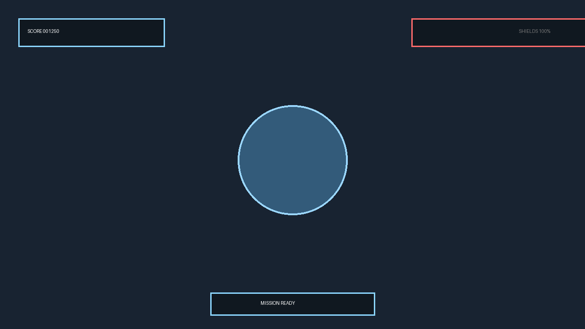
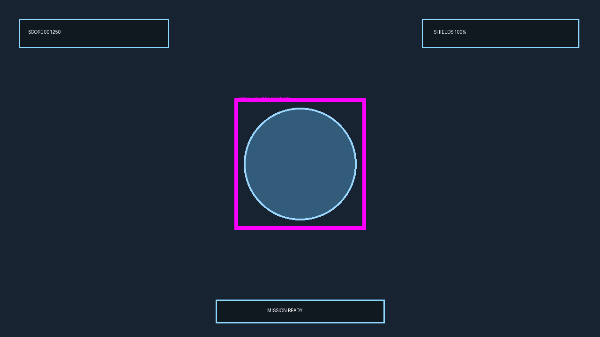
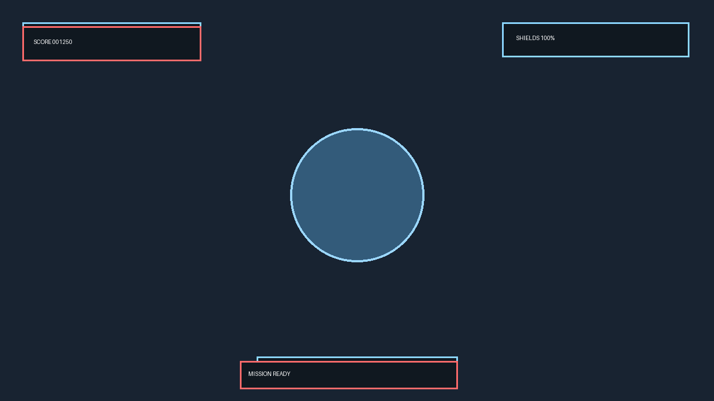

# Witness QA Report

## Summary

Witness tested **examples/game_visual_review** as **Game visual QA director** and recorded **3 evidence-backed findings**. Overall status: **Goal Blocked**.

## Persona

- **Role:** A senior game UI and visual-quality tester evaluating the player-visible experience frame by frame.
- **Goal:** Identify visual defects, inconsistencies, hierarchy problems, readability failures, and cross-frame state discontinuities that reduce polish or player comprehension.
- **Success criteria:** HUD, menus, feedback, animation states, safe areas, typography, assets, colors, spacing, scale, z-order, and transitions are coherent across supported frames and resolutions.
- **Known constraints:** Judge only observable evidence. Distinguish confirmed visual facts from engine/source hypotheses and suggest targeted verification or fixes.
- **Environment:** desktop, en-US, normal, light

## Findings

### 1. [HIGH] The right SHIELDS panel continues beyond the right frame edge and its label is rendered in very low-contrast gray, while the left SCORE panel is fully visible and bright.

- **Fingerprint:** `05d780799f239587`
- **Expected:** The gameplay HUD should remain inside the 1280×720 safe area, use consistent panel geometry, and keep critical shield text readable.
- **Observed fact:** The right SHIELDS panel continues beyond the right frame edge and its label is rendered in very low-contrast gray, while the left SCORE panel is fully visible and bright.
- **Judgment:** A critical status display is both partially clipped and substantially less readable than its symmetric counterpart, creating resolution-dependent information loss and inconsistent hierarchy.
- **Visual assessment:** Confirmed clipping at the right edge, asymmetric border color, and poor text contrast in the SHIELDS panel.
- **Black-box hypothesis:** The right HUD anchor or width may be calculated from an incorrect canvas boundary, and the shield text may be using a disabled/placeholder color token.
- **Suggested investigation:** Anchor both top HUD panels to a shared safe-area container, clamp the right edge, and use the approved high-contrast text token; verify at 16:9, ultrawide, and reduced-width resolutions.
- **Evidence:** [screenshots/001_game_frame.png](screenshots/001_game_frame.png)

### 2. [HIGH] A bright magenta rectangle and the text 'STALE DEBUG BOUNDS' remain over the central gameplay object in the final frame.

- **Fingerprint:** `ac73e917b72fb101`
- **Expected:** A player-facing gameplay frame should not expose editor/debug overlays, and debug labels should never occlude the focal object.
- **Observed fact:** A bright magenta rectangle and the text 'STALE DEBUG BOUNDS' remain over the central gameplay object in the final frame.
- **Judgment:** The debug overlay is unmistakably player-visible, conflicts with the art direction, and partially occludes the central object.
- **Visual assessment:** Confirmed high-saturation debug bounds and text with incorrect z-order over the gameplay focal point.
- **Black-box hypothesis:** A development-only bounds renderer or stale diagnostic layer may be enabled in the player build or not cleared during a state transition.
- **Suggested investigation:** Gate diagnostic rendering behind development-build flags, clear overlay state on scene transitions, and add a release-capture check that rejects debug-layer colors/labels.
- **Evidence:** [screenshots/003_game_frame.png](screenshots/003_game_frame.png)

### 3. [MEDIUM] The SCORE panel shifts downward relative to the previous frame, and the MISSION READY panel shifts left and downward while the center object and SHIELDS panel remain stable.

- **Fingerprint:** `06fa60ee29920954`
- **Expected:** Persistent HUD panels should keep stable anchors and baselines across adjacent frames unless an intentional animation is visible.
- **Observed fact:** The SCORE panel shifts downward relative to the previous frame, and the MISSION READY panel shifts left and downward while the center object and SHIELDS panel remain stable.
- **Judgment:** Independent movement of otherwise static HUD containers produces visible jitter and breaks alignment consistency across frames.
- **Visual assessment:** The top-left and bottom-center containers visibly drift while the rest of the composition is unchanged.
- **Black-box hypothesis:** The panels may be positioned from content-dependent bounds or separate animation/layout systems instead of stable anchors.
- **Suggested investigation:** Use fixed safe-area anchors and shared layout constraints for persistent HUD elements; add screenshot assertions for panel bounds across stable gameplay frames.
- **Evidence:** [screenshots/002_game_frame.png](screenshots/002_game_frame.png)

## Full Narrative Trace

Turn 1: Initial observation

- **Expectation:** The gameplay HUD should remain inside the 1280×720 safe area, use consistent panel geometry, and keep critical shield text readable.
- **Observation:** The right SHIELDS panel continues beyond the right frame edge and its label is rendered in very low-contrast gray, while the left SCORE panel is fully visible and bright.
- **Judgment:** mismatch (high confidence)
- **Reasoning:** A critical status display is both partially clipped and substantially less readable than its symmetric counterpart, creating resolution-dependent information loss and inconsistent hierarchy.
- **Next action:** next_frame — Inspect the next gameplay state for cross-frame alignment consistency.
- **Observation delta:** `{"changed_text": ["{", "  \"frame_source\": \"examples/game_visual_review/frames/frame_01.png\",", "  \"frame_index\": 0,", "  \"frame_count\": 3,", "  \"visual_metrics\": {", "    \"width\": 1280,", "    \"height\": 720,", "    \"entropy\": 0.70957,", "    \"edge_density\": 0.00817,", "    \"blank_ratio\": 0.86514,", "    \"dominant_colors\": [", "      \"#182331\",", "      \"#38526a\",", "      \"#121a23\",", "      \"#192331\",", "      \"#182330\",", "      \"#162331\"", "    ],", "    \"perceptual_hash\": \"8000181818180018\",", "    \"change_ratio\": 0.0,"], "new_errors": ["The frame has very low global luminance contrast."], "resolved_errors": [], "visual_change_ratio": 0.0, "changed_interactives": []}`
- **Evidence:** [screenshots/001_game_frame.png](screenshots/001_game_frame.png)

Turn 2: next_frame

- **Expectation:** Persistent HUD panels should keep stable anchors and baselines across adjacent frames unless an intentional animation is visible.
- **Observation:** The SCORE panel shifts downward relative to the previous frame, and the MISSION READY panel shifts left and downward while the center object and SHIELDS panel remain stable.
- **Judgment:** mismatch (high confidence)
- **Reasoning:** Independent movement of otherwise static HUD containers produces visible jitter and breaks alignment consistency across frames.
- **Next action:** next_frame — Inspect the final frame for state residue or debug-layer defects.
- **Observation delta:** `{"changed_text": ["\"#121a24\",", "\"#172331\"", "\"#1f232c\",", "\"#3c5167\",", "\"blank_ratio\": 0.85938,", "\"change_ratio\": 0.0122,", "\"difference_ratio\": 0.008814,", "\"edge_density\": 0.00976,", "\"entropy\": 0.73518,", "\"frame_index\": 1,", "\"frame_source\": \"examples/game_visual_review/frames/frame_02.png\",", "\"kind\": \"next_frame\",", "\"perceptual_hash\": \"c700181818180038\",", "\"recent_actions\": [", "\"reference\": \"examples/game_visual_review/references/frame_02.png\"", "\"summary\": \"next_frame\""], "new_errors": [], "resolved_errors": [], "visual_change_ratio": 0.0122, "changed_interactives": []}`
- **Evidence:** [screenshots/002_game_frame.png](screenshots/002_game_frame.png)

Turn 3: next_frame

- **Expectation:** A player-facing gameplay frame should not expose editor/debug overlays, and debug labels should never occlude the focal object.
- **Observation:** A bright magenta rectangle and the text 'STALE DEBUG BOUNDS' remain over the central gameplay object in the final frame.
- **Judgment:** mismatch (high confidence)
- **Reasoning:** The debug overlay is unmistakably player-visible, conflicts with the art direction, and partially occludes the central object.
- **Next action:** goal_blocked — The visual-polish goal is blocked by multiple confirmed HUD and debug-overlay defects.
- **Observation delta:** `{"changed_text": ["\"#15232e\",", "\"#182332\",", "\"#2f1840\"", "\"#304e64\",", "\"#3c2353\",", "\"blank_ratio\": 0.84315,", "\"change_ratio\": 0.01845,", "\"difference_ratio\": 0.009637,", "\"edge_density\": 0.01022,", "\"entropy\": 0.76862,", "\"frame_index\": 2,", "\"frame_source\": \"examples/game_visual_review/frames/frame_03.png\",", "\"perceptual_hash\": \"8200181818180018\",", "\"reference\": \"examples/game_visual_review/references/frame_03.png\""], "new_errors": [], "resolved_errors": [], "visual_change_ratio": 0.01845, "changed_interactives": []}`
- **Evidence:** [screenshots/003_game_frame.png](screenshots/003_game_frame.png)

## Session Metadata

- **Witness:** 1.0.0
- **Project revision:** `unknown`
- **Project type:** game
- **Detection confidence:** medium
- **Adapter:** game
- **Reasoning provider/model:** scripted / `host-agent-decisions`
- **Turns:** 3
- **Duration:** 0.39s
- **Provider requests:** 3
- **Tokens:** 0 input / 0 output
- **Estimated cost:** $0.0000
- **Started:** 2026-07-11T21:56:39.480466+00:00
- **Finished:** 2026-07-11T21:56:39.871909+00:00

### Detection Evidence

- `filesystem` → **game** (+6): Game/UI screenshot sequence detected

---

Generated by Witness. Verify findings against the linked evidence before acting.
