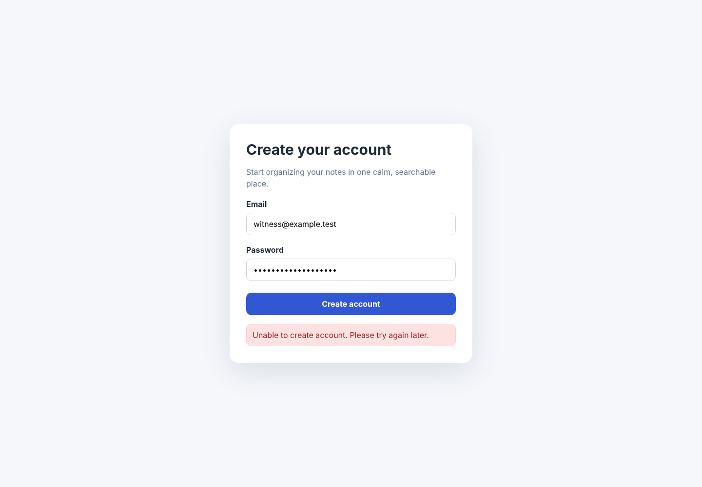

# Witness QA Report

## Summary

Witness tested **examples/buggy_signup** as **First-time user** and recorded **1 evidence-backed finding**. Overall status: **Goal Blocked**.

## Persona

- **Role:** A moderately tech-savvy person who has never used this product before. They rely on visible labels and normal conventions, do not know hidden shortcuts, and expect onboarding to explain itself.

- **Goal:** Discover the product's primary purpose and complete its main first-use flow successfully.

- **Success criteria:** The primary flow can be completed without prior product knowledge, with clear feedback and an unambiguous successful end state.

- **Known constraints:** Do not bypass authentication, email verification, payment, or safety controls. Record external dependencies as blockers instead of fabricating access.

- **Environment:** desktop, en-US, normal, light

## Findings

### 1. [HIGH] A visible error says 'Unable to create account. Please try again later.' and the user remains on the signup form.

- **Fingerprint:** `1fd02dfc68ed806b`
- **Expected:** A valid signup submission should end in an unambiguous success state or a specific recoverable validation message.
- **Observed fact:** A visible error says 'Unable to create account. Please try again later.' and the user remains on the signup form.
- **Judgment:** The core first-use journey is blocked after representative valid input, and the generic message gives no recovery path beyond retrying.
- **Visual assessment:** The error is visible, but it is generic and does not identify a field or corrective action.
- **Black-box hypothesis:** The public signup submission boundary may be returning a server-side failure or failing to persist the new account.
- **Suggested investigation:** Reproduce the POST triggered by Create account, correlate its status and server logs, and add a specific recoverable error while fixing the failed account-creation path.
- **Evidence:** [screenshots/004_web_state.png](screenshots/004_web_state.png)

## Full Narrative Trace

Turn 1: Initial observation

- **Expectation:** A first-time user should see a clear signup form with usable email and password fields.
- **Observation:** The page shows a Create your account form with Email, Password, and Create account controls.
- **Judgment:** match (high confidence)
- **Reasoning:** The primary signup affordances are visible and understandable, so the next reversible step is to enter a valid email.
- **Next action:** type: Email — Enter representative valid signup data.
- **Observation delta:** `{"changed_text": ["{", "  \"title\": \"Acorn Notes — Sign up\",", "  \"url\": \"http://127.0.0.1:4173/\",", "  \"viewport\": {", "    \"width\": 1440,", "    \"height\": 1000", "  },", "  \"scroll\": {", "    \"x\": 0,", "    \"y\": 0,", "    \"max_y\": 0", "  },", "  \"visible_text\": \"Create your account\\n\\nStart organizing your notes in one calm, searchable place.\\n\\nEmail\\nPassword\\n Create account\",", "  \"interactive\": [", "    {", "      \"index\": 5,", "      \"tag\": \"input\",", "      \"role\": \"\",", "      \"name\": \"email\",", "      \"type\": \"email\","], "new_errors": [], "resolved_errors": [], "visual_change_ratio": 0.0, "changed_interactives": []}`
- **Evidence:** [screenshots/001_web_state.png](screenshots/001_web_state.png)

Turn 2: type: Email

- **Expectation:** The email field should accept the entered address without an error.
- **Observation:** The signup form remains visible and no validation error is shown after entering the email.
- **Judgment:** match (high confidence)
- **Reasoning:** There is no visible rejection, so the password can be entered next.
- **Next action:** type: Password — Complete the required signup fields.
- **Observation delta:** `{"changed_text": [], "new_errors": [], "resolved_errors": [], "visual_change_ratio": 0.002, "changed_interactives": []}`
- **Evidence:** [screenshots/002_web_state.png](screenshots/002_web_state.png)

Turn 3: type: Password

- **Expectation:** With valid required fields present, submitting should create the account or present actionable validation.
- **Observation:** The form remains ready for submission and no field-level error is visible.
- **Judgment:** match (high confidence)
- **Reasoning:** The next user action is to submit the completed form.
- **Next action:** click: Create account — Attempt the primary user journey.
- **Observation delta:** `{"changed_text": [], "new_errors": [], "resolved_errors": [], "visual_change_ratio": 0.00299, "changed_interactives": []}`
- **Evidence:** [screenshots/003_web_state.png](screenshots/003_web_state.png)

Turn 4: click: Create account

- **Expectation:** A valid signup submission should end in an unambiguous success state or a specific recoverable validation message.
- **Observation:** A visible error says 'Unable to create account. Please try again later.' and the user remains on the signup form.
- **Judgment:** mismatch (high confidence)
- **Reasoning:** The core first-use journey is blocked after representative valid input, and the generic message gives no recovery path beyond retrying.
- **Next action:** goal_blocked — The signup goal is observably blocked by product behavior.
- **Observation delta:** `{"changed_text": ["\"'Email\\nPassword\\n Create account\\nUnable to create account. Please try again later.' has estimated contrast ratio 1.43:1.\",", "\"Unable to create account. Please try again later.\"", "\"alerts\": [", "\"background\": \"rgb(254, 226, 226)\",", "\"color\": \"rgb(153, 27, 27)\",", "\"contrast_ratio\": 6.802728419777387", "\"height\": 302", "\"height\": 490", "\"index\": 9,", "\"name\": \"Create your account\\n\\nStart organizing your notes in one calm, searchable place.\\n\\nEmail\\nPassword\\n Create account\\nUnable to create account. Please try again later\",", "\"name\": \"Email\\nPassword\\n Create account\\nUnable to create account. Please try again later.\",", "\"name\": \"Unable to create account. Please try again later.\",", "\"role\": \"alert\",", "\"tag\": \"div\",", "\"visible_text\": \"Create your account\\n\\nStart organizing your notes in one calm, searchable place.\\n\\nEmail\\nPassword\\n Create account\\nUnable to create account. Please try again later.\",", "\"y\": 255,", "\"y\": 289,", "\"y\": 341,", "\"y\": 409,", "\"y\": 437,", "\"y\": 503,", "\"y\": 531,", "\"y\": 601,", "\"y\": 665,"], "new_errors": [], "resolved_errors": [], "visual_change_ratio": 0.05569, "changed_interactives": []}`
- **Evidence:** [screenshots/004_web_state.png](screenshots/004_web_state.png)

## Session Metadata

- **Witness:** 1.0.0
- **Project revision:** `unknown`
- **Project type:** web
- **Detection confidence:** high
- **Adapter:** web
- **Reasoning provider/model:** scripted / `host-agent-decisions`
- **Turns:** 4
- **Duration:** 5.47s
- **Provider requests:** 4
- **Tokens:** 0 input / 0 output
- **Estimated cost:** $0.0000
- **Started:** 2026-07-11T21:54:57.756351+00:00
- **Finished:** 2026-07-11T21:55:03.223040+00:00

### Detection Evidence

- `filesystem` → **web** (+5): index.html detected
- `app.py` → **cli** (+4): CLI framework and executable main guard detected
- `app.py` → **web** (+4): Python web server/framework code detected
- `README.md` → **web** (+6): README run instruction: python app.py --port 4173

---

Generated by Witness. Verify findings against the linked evidence before acting.
